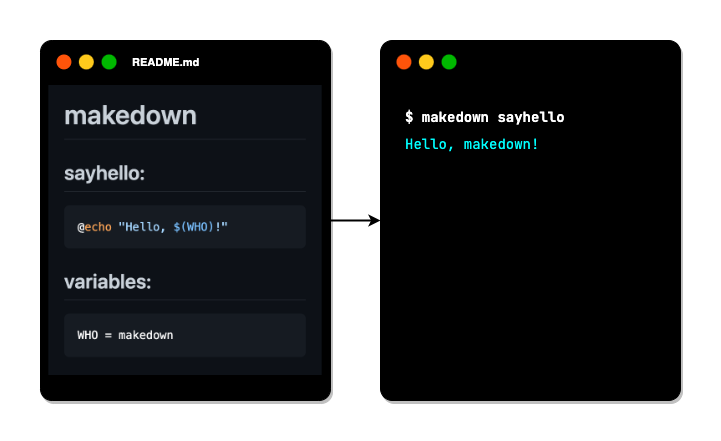

# makedown

`makedown` is a `make` command wrapper for Markdown files.

You can execute `make` targets written in `*.md` files by the `make` command.

It enables you to write `make` targets in `Makefile.md` or `README.md`, etc.



- You can write descriptions about `make` targets with texts, images, and even with tables, in markdown format.
- You can integrate your `README.md` and `Makefile` into the same file.

## How it works

- `makedown` extracts `make` target definitions from the input Markdown file.
- `makedown` reads `Makefile.md` or `README.md` implicitly, if it exists.
- Then, it executes the given target by the `make` command.

## Example

This `README.md` is also an example of `makedown`.

```sh
# You can execute the `sayhello` target in the next section, like below:
$ makedown sayhello
Hello makedown!
```

### `sayhello:`

```sh
@echo "Hello, $(WHO)!"
```

### `saygoodbye:`

```sh
@echo "Bye for now," `date +%Y/%m/%d`
```

### `variables:`

```makefile
WHO = makedown
```

### Usage

```sh
# This reads Makefile.md or README.md implicitly, then executes the given target.
$ makedown sayhello
Hello makedown!

# (-f) option is used to specifiy the input Markdown file explicitly.
$ makedown -f README.md sayhello
Hello makedown!

# This just generates 'Makefile'. No target will be executed.
$ makedown --out

# This generates the Makefile as 'MyMakefile', then executes the given target.
$ makedown --out MyMakefile sayhello
Hello makedown!

# This executes sayhello and saygoodbye by 'gmake' command.
$ makedown --make gmake sayhello saygoodbye
Hello makedown!
Bye for now, 2022/05/14

# The rest of arguments with double dash (--) will be passed to the 'make' command.
# ex.) The option (-w) is (print the current directory)
$ makedown -- -w sayhello
make: Entering directory ...
Hello makedown!
make: Leaving directory ...
```

## Help

````
$ makedown -h
'makedown' is a 'make' command wrapper for Markdown files.
You can write 'make' targets in 'Makefile.md' or 'README.md', etc.
'makedown' executes 'make' targets written in *.md files by the 'make' command.

For more information,
  https://github.com/hirokistring/makedown

Usage:
  makedown [flags] [targets] ..

Examples:
  $ cat README.md

  # sayhello:
    ```
    @echo Hello, $(WHO)!
    ```
  # variables:
    ```
    WHO = makedown
    ```

  $ makedown sayhello
  Hello, makedown!


Flags:
  -h, --help              help for makedown
      --make string       make command name in the PATH, like 'gmake'
  -f, --markdown string   input markdown file name
      --out string        output makefile name
      --verbose           prints verbose messages
  -v, --version           version for makedown
````

Other command line arguments will be passed to the `make` command at the run time.
Threfore, you can use the almost all command line options of the `make` command.

## Environment Variables

- `MAKEDOWN_INPUT_FILE`

  Give the input markdown file name as the default.

  Example:

  ```sh
  export MAKEDOWN_OUTPUT_FILE=Makefile.md
  ```

- `MAKEDOWN_OUTPUT_FILE`

  Give the output file name generated at the runtime.

  Example:

  ```sh
  export MAKEDOWN_OUTPUT_FILE=Makefile
  ```

- `MAKEDOWN_MAKE_COMMAND`

  Give the make command name in the PATH, like `make` or `gmake`.

  Example:

  ```sh
  export MAKEDOWN_MAKE_COMMAND=make
  ```

All above values are the default values.

## How to install

Download and extract the `makedown` executable file from the [Releases](https://github.com/hirokistring/makedown/releases) page.

## For more details

Read the [DETAILS.md](docs/DETAILS.md).
