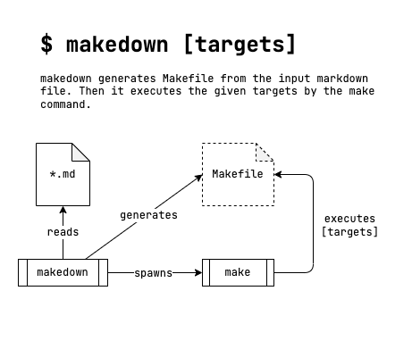

# The details of `makedown`

## Architecture

`makedown` is a simple CLI command written in Go.



1. It just extracts `make` target definitions from the input markdown file with the special conventions of the markdown syntax.
1. Then, it generates a temporary `Makefile` at the run time.
1. Then, it executes the given targets by the `make` command.
1. The temporary `Makefile` will be deleted after the `make` command completed.
   The temporary `Makefile` will be kept, only when the `--out` option is given.

`makedown` uses [Blackfriday v2](https://github.com/russross/blackfriday/tree/v2) as the markdown parser.

Also, `makedown` uses [Cobra](https://github.com/spf13/cobra) as the CLI command framework.

## Syntax

`makedown` do NOT break any markdown syntax.

That means there is NO special keyword added to the markdown syntax.

`makedown` just have special **_convensions_** for the markdown syntax.

### How To Define **_Targets_**

````markdown
## build:

Type `makedown build` to execute this target.

```
cd cmd/makedown
go build
```

## How to `realease:`

```
goreleaser release --rm-dist
```
````

- Add a section with a `:` colon at the end of the header names.
- If the header name is composed of multiple words, only the last word with a colon is used.
- For example, section named "**_How to `release:`_**" can be executed by `makedown release`.
- Asterisks or underscores for **Bold** and _Italic_, and single backtick \` for `Code` are ignored when the word ends with a colon.
- Sections must have at least one or more `code blocks` by three backticks \`\`\`.
- All `code blocks` will be concatenated and evaluated in the order of appearance at the run time of `makedown`

### How To Define **_Variables_** and **_Directives_**

````markdown
## `makedown:`

```
include .env

.PHONY: all build release
.ONESHELL:
```
````

- Add section named `variables:` or `makedown:`
- The syntax of how to define variables is same as the `make` command.
- `variables:` and `makedown:` section may appear multiple times in the input markdown file.
- Sections must have at least one or more `code blocks`.
- All `code blocks` will be concatenated and evaluated in the order of appearance at the run time of `makedown`

### How To Define **_Prerequisites_** of a Target

````markdown
### sayhello:

> : WHO = makedown

> : openmouth

```makefile
echo Hello, $(WHO).
```
````

The above section will be translated to:

```makefile
sayhello: WHO = makedown
sayhello: openmouth
  echo Hello, $(WHO).
```

- Add a Blockquote with a `:` (colon) at the beginning.
- The rest of the Blockquote will be added to the right of the target.
- Asterisks or underscores for Bold and Italic, and backticks for Code surrounding of the Blockquote are ignored when the Blockquote begins with a colon.

### Examples

For other examples, see [EXAMPLE.md](../tests/case2/EXAMPLE.md).

## Inputs

**Input File Searching Order:**

1. Markdown file given explicitly with the command line option: `-f`
1. Markdown file given implicitly with the environment variable: `MAKEDOWN_INPUT_FILE`
1. `Makefile.md`
1. `README.md`

`makedown` assumes that you have `Makefile.md` by default.
If there is no `Makefile.md`, then it tries to find `README.md` instead of `Makefile.md`.
Otherwise, you can specify the input file by the command line argument, or by the environment variable.

## Outputs

**Output File Order**

1. File name given explicitly with the command line option: `--out`.
1. File name given implicitly with the environment variable: `MAKEDOWN_OUTPUT_FILE`.
1. Otherwise, `Makefile` will be used by default.

**Translation Order**

All `makedown:` sections, `variables:` sections, and any target sections will be translated in the order of appearance.

_Blockquotes_ and _Code Blocks_ will also be translated in the order of appearance.
